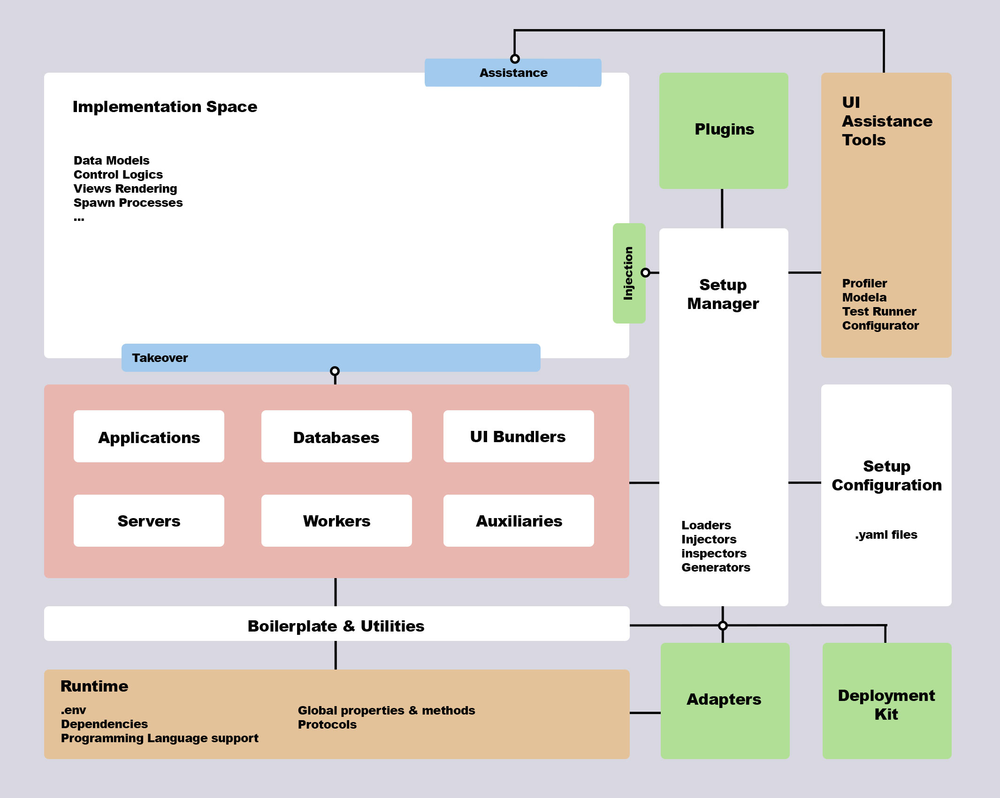

# Architecture & Components

This document explains the internal architecture of Kenx-JS and how its components work together.

## Architecture Overview



*The diagram above illustrates Kenx's layered architecture including the Implementation Space (where application code lives), the Takeover system (dependency injection), Resource layer (servers, databases, workers, auxiliaries), Setup Manager (configuration loading), Boilerplate & Utilities, Runtime layer, and extension components (Plugins, Adapters, Deployment Kit, and UI Assistance Tools).*

## High-Level Architecture

```
┌─────────────────────────────────────────────────────┐
│                   CLI Layer                         │
│  (ckenx create, build, run, install, uninstall)    │
└─────────────────┬───────────────────────────────────┘
                  │
┌─────────────────▼───────────────────────────────────┐
│              Setup Manager                          │
│  - Configuration Loader                             │
│  - Plugin Import Handler                            │
│  - Reference Resolver                               │
│  - TypeScript Compiler                              │
└─────────────────┬───────────────────────────────────┘
                  │
┌─────────────────▼───────────────────────────────────┐
│                Core System                          │
│  - Autoloader                                       │
│  - Resource Creator                                 │
│  - Dispatcher                                       │
└─────────────────┬───────────────────────────────────┘
                  │
        ┌─────────┴─────────┐
        │                   │
┌───────▼────────┐  ┌───────▼────────┐
│    Services    │  │   Resources    │
│  - HTTP        │  │  - Databases   │
│  - Socket.io   │  │  - Storage     │
│  - WebSocket   │  │  - Cache       │
└────────────────┘  └────────────────┘
```

## Core Components

### 1. CLI Layer

**Location:** `packages/cli/`

The command-line interface provides developer tools for project management.

**Key Files:**
- `src/index.ts` - Command parser and router
- `src/create.ts` - Project scaffolding
- `src/build.ts` - Build orchestration
- `src/run.ts` - Development/production runner
- `src/install.ts` - Plugin installation
- `templates/` - Project templates

**Commands:**
- `ckenx create <directory>` - Create new project
- `ckenx build` - Build TypeScript project
- `ckenx run [--prod]` - Run application
- `ckenx install <plugin>` - Install plugin
- `ckenx uninstall <plugin>` - Uninstall plugin

### 2. Setup Manager

**Location:** `packages/node/src/setup.ts`

The Setup Manager is responsible for loading and resolving configuration files, importing plugins, and managing the project setup.

**Key Responsibilities:**

#### Configuration Loading
```typescript
async loadConfig(target: SetupTarget): Promise<SetupConfig>
```
- Parses YAML configuration files
- Handles `__extends__` for cross-file references
- Resolves configuration references `[section]:key`

#### Plugin Management
```typescript
async importPlugin(refname: string)
```
- Checks local plugins (`./src/plugins/`)
- Falls back to node_modules
- Auto-installs missing plugins in development

#### Module Resolution
```typescript
async importModule(path: string, throwError = false)
```
- Resolves TypeScript/JavaScript modules
- Handles both source and compiled paths
- Supports custom directory structures

#### TypeScript Compilation
- Automatic compilation in development mode
- Uses `tsc-prog` for programmatic builds
- Supports `tsc-alias` for path aliases

**Configuration Reference Resolution:**

The Setup Manager uses regex patterns to resolve references:
```typescript
[env]:HTTP_PORT        // Environment variable
[servers]:default      // Server configuration
[databases]:primary    // Database configuration
```

### 3. Core System

**Location:** `packages/node/src/index.ts`

The Core is the heart of Kenx, orchestrating the entire application lifecycle.

**Key Methods:**

#### `autoload()`
Loads and initializes all configured resources:

1. Load environment variables (`.env` or `.env.local`)
2. Initialize Setup Manager
3. Connect to databases
4. Create and start servers
5. Register resources in `RESOURCES` registry

```typescript
async autoload(): Promise<void> {
  dotenv.config()
  await Setup.dev()
  
  const { servers, databases } = Setup.getConfig()
  
  // Connect databases
  for (const config of databases) {
    const db = await createResource(config)
    RESOURCES[`database:${config.key}`] = db
  }
  
  // Start servers
  for (const config of servers) {
    const server = await createHTTPServer(config)
    RESOURCES[`${config.type}:${config.key}`] = server
  }
}
```

#### `dispatch(takeover?: string[])`
Routes execution based on directory pattern:

- **Singleton pattern** (`pattern: '-'`): Loads `src/index.ts`
- **MVC pattern** (`pattern: 'mvc'`): Loads models → views → controllers

```typescript
async dispatch(takeover?: string[]) {
  const { directory } = Setup.getConfig()
  
  switch(directory.pattern) {
    case 'mvc': 
      await toMVC()
      break
    default: 
      await toSingleton(takeover)
  }
}
```

#### `build()`
Production build process:

1. Clean output directory
2. Compile TypeScript
3. Run asset builders (Vite, Webpack, etc.)

### 4. Resource System

Resources are services managed by Kenx (servers, databases, etc.).

**Resource Registry:**
```typescript
RESOURCES: {
  'http:default': ServerPlugin<http.Server>,
  'socketio:chat': ServerPlugin<io.Server>,
  'database:default': DatabasePlugin<Connection>
}
```

**Resource Creators:**

- `createHTTPServer()` - HTTP/HTTPS servers
- `createAuxiliaryServer()` - Socket.io, WebSocket, etc.
- `createResource()` - Databases, caches, storage
- `createBuild()` - Build tools (Vite, Webpack)

**Resource Injection (Takeover):**

```typescript
function getResource(arg: string | string[]): any
```

Resolves takeover patterns:
- `'http'` → `RESOURCES['http:default']`
- `'database:*'` → All databases
- `['http', 'socketio']` → Multiple resources

### 5. Plugin System

Plugins extend Kenx functionality through standard interfaces.

**Plugin Types:**

#### ServerPlugin
```typescript
interface ServerPlugin<T> {
  listen(config: any): Promise<void>
  getInfo(): { port: number, host: string }
}
```

Examples: `kenx-http`, `kenx-socketio`

#### DatabasePlugin
```typescript
interface DatabasePlugin<T> {
  connect(): Promise<void>
  disconnect(): Promise<void>
  getConnection(): T
}
```

Examples: `kenx-mysql`, `kenx-mongodb`

#### ApplicationPlugin
```typescript
interface ApplicationPlugin<T> {
  serve(): Promise<ServerPlugin<T>>
}
```

Examples: `kenx-express`, `kenx-fastify`

**Plugin Discovery:**

1. Check `./src/plugins/<plugin-name>`
2. Check `node_modules/<plugin-name>`
3. Auto-install if missing (development only)

### 6. Configuration System

**Location:** `.config/`

YAML-based configuration with powerful features:

#### Cross-File Extension
```yaml
# .config/index.yml
__extends__: ['servers', 'databases']
```

#### Reference Resolution
```yaml
servers:
  - HOST: [env]:HTTP_HOST
    PORT: [env]:HTTP_PORT
```

#### Plugin Auto-Collection
When a plugin is referenced, it's automatically added to the install queue.

## Execution Flow

### Development Mode

```
1. ckenx run / ./autorun
   ↓
2. Core.autoload()
   ↓
3. Setup.dev()
   ├─ Load configuration
   ├─ Install missing plugins
   └─ Compile TypeScript
   ↓
4. Connect databases
   ↓
5. Start servers
   ↓
6. Core.dispatch()
   ├─ Load entry point
   └─ Inject resources (takeover)
```

### Production Mode

```
1. ckenx build
   ↓
2. Setup.build()
   ├─ Clean dist/
   ├─ Compile TypeScript
   └─ Run asset builders
   ↓
3. ckenx run --prod
   ↓
4. Core.autoload()
   ↓
5. Core.dispatch()
```

## Directory Patterns

### Singleton Pattern

```
src/
├── index.ts          # Entry point with takeover
├── routes/
├── services/
└── utils/
```

Execution: Load `index.ts` → Inject resources → Execute default export

### MVC Pattern

```
src/
├── models/
│   └── index.ts      # export default (databases) => {...}
├── views/
│   └── index.ts      # export default () => {...}
└── controllers/
    └── index.ts      # export default (http, models, views) => {...}
```

Execution: Load models → Load views → Load controllers → Inject resources

## Design Decisions

### Why Config-First?

- **Declarative** - Easier to understand and modify
- **Consistent** - Same structure across projects
- **Portable** - Configuration is separate from logic
- **Type-Safe** - TypeScript types for all configs

### Why Auto-Install Plugins?

- **Developer Experience** - No manual dependency management
- **Consistency** - Plugins match Kenx version
- **Simplicity** - One source of truth (config files)

### Why Takeover Pattern?

- **Explicit Dependencies** - Clear what your code needs
- **Testability** - Easy to mock resources
- **Flexibility** - Request exactly what you need

## Extension Points

Kenx can be extended through:

1. **Custom Plugins** - Implement plugin interfaces
2. **Local Plugins** - Place in `./src/plugins/`
3. **Configuration** - Extend with custom YAML files
4. **Middleware** - Use framework-specific middleware

## Next Steps

- **[CLI Documentation](./cli.md)** - Complete CLI command reference
- **[Creating Applications](./create.md)** - Project creation guide
- **[Configuration System](../configuration/index.md)** - Deep dive into YAML config

---

**Previous:** [← The Project](./index.md) | **Next:** [CLI →](./cli.md)
